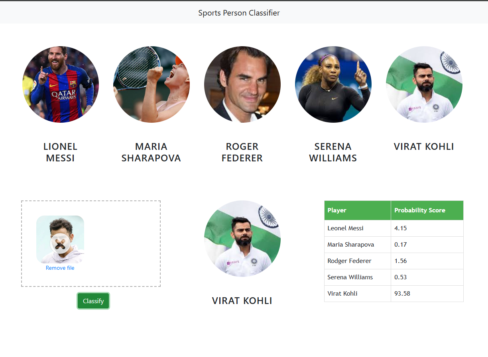

# 🏅 Sports Celebrity Image Classification

_A **Machine Learning + Computer Vision project** to classify images of sports personalities using **SVM, Flask, OpenCV, and Docker**._

---

## 📘 Overview

This Data Science & Machine Learning project focuses on building an **image classification system** that identifies one of **five famous sportspersons** (e.g., Virat Kohli, Roger Federer, Maria Sharapova, Serena Williams, and Lionel Messi).  

The model was trained using images **collected in bulk via the Fatkun Chrome Extension** from Google Images.  
After **Machine Learning model training**, the system was deployed with a **Flask API** and an **interactive web UI** that lets users upload an image and instantly get classification results with probability scores. (User Interface Snapshot attached below)

---

## 🎯 Problem Statement

This project was developed as a hands-on learning exercise to strengthen my understanding of computer vision, image processing, and end-to-end ML model development & deployment.
It simulates a real-world scenario in the sports media and analytics industry, where automated systems classify athlete images to streamline tagging and digital asset management.

The goal of this project was to design an **end-to-end, lightweight, and easily deployable** machine learning pipeline that:
- Classifies a given image of a sportsperson.
- Runs inside a single **Docker container** (frontend + backend + model).
- Offers a web interface that allows easy testing of predictions.

---


---

## ⚙️ Tech Stack

| Layer | Technologies / Tools                                                                                                     |
|-------|--------------------------------------------------------------------------------------------------------------------------|
| **Programming** | Python                                                                                                                   |
| **Backend** | Flask Framework                                                                                                          |
| **Frontend** | HTML, CSS, JavaScript                                                                                                    |
| **Machine Learning** | Supervised Learning, scikit-learn (Logistic Regression, SVM, Random forest (Ensemble Learning)), OpenCV, NumPy, Pandas, matplotlib |
| **Model Artifacts** | `trained_model.pkl`, `class_dictionary.json`                                                                             |
| **Server / Deployment** | Nginx, Docker                                                                                                            |
| **Data Collection** | Fatkun Batch Download Extension (Google Images)                                                                          |

---

## 🧱 Project Structure

```
Image_classification/
│
├── frontend/                 # HTML, CSS, JS for web interface
│   ├── app.html
│   ├── app.css
│   ├── app.js
│   ├── dropzone.min.js
│   └── dropzone.min.css
│
├── model/                    # Model artifacts and training notebook
│   ├── class_dictionary.json
│   ├── trained_model.pkl
│   ├── sports_person_classification.ipynb
│   ├── dataset/              # Raw dataset and cropped cleaned dataset inside cropped folder)
│   ├── opencv/               # Image preprocessing utilities
│   └── test_images/          # Test samples
│
├── server/                   # Flask backend and logic
│   ├── main.py               # Flask entry point
│   ├── util.py               # Loads model & performs prediction
│   └── wavelet.py            # Custom feature extraction using Wavelet transform
│
├── requirements.txt          # Python dependencies
├── Dockerfile                # Builds Flask + Nginx app container
├── start.sh                  # Launch script for Flask + Nginx
└── README.md
```

---

## 🧠 Model Development

1. **Data Collection:**  
   - Used **Fatkun Chrome Extension** to download images of 5 sportspersons from Google Images in bulk.  
   - Cleaned and organized images into folders by name.

2. **Feature Extraction:**  
   - Extracted **face regions** using OpenCV Haar Cascade classifiers.  
   - Applied **wavelet transforms** (`wavelet.py`) for feature enhancement.
   - there is some manual cleaning of image perform such as removing blur image and those images which are extracted different face in multiperson in same image

3. **Model Training:**  
   - Used **Logistic Regression**, **Support Vector Machine (SVM)**, **Random Forest** with hyperparameter tuning **(Grid Search)**.  
   - Stored model artifacts (`trained_model.pkl`, `class_dictionary.json`) for inference.

4. **Prediction Pipeline:**  
   - `util.py` loads the model and performs prediction using extracted features.  
   - Flask API exposes `/classify_image` endpoint to receive image data and return predictions.

---

## 🧩 How to Reproduce or Run the Project

### Option 1️⃣ — Run Directly with Docker (Recommended)

You can use the prebuilt image from Docker Hub:

```bash
docker pull abhishek11101/image_classification_app:v1
docker run -d -p 80:80 --name sports_classifier abhishek11101/image_classification_app:v1
```

Then open **[http://localhost](http://localhost)** in your browser 🎉

---

### Option 2️⃣ — Build from Source

```bash
# 1. Clone the repository
git clone https://github.com/abhishekokumar/image_classification.git
cd image_classification

# 2. Build Docker image
docker build -t image_classification_app .

# 3. Run container
docker run -d -p 80:80 image_classification_app
```

---

### Option 3️⃣ — Run Without Docker

```bash
# Create a virtual environment
python -m venv venv
source venv/bin/activate  # (Windows: venv\Scripts\activate)

# Install dependencies
pip install -r requirements.txt

# Run the Flask backend
python server/main.py

# Open frontend/app.html manually in your browser
```

---

## 🧩 Nginx + Flask Integration

Nginx serves the frontend from `/app/frontend` and proxies all `/api` requests to Flask at `127.0.0.1:5000`.

```nginx
location /api/ {
    rewrite ^/api(.*) $1 break;
    proxy_pass http://127.0.0.1:5000;
    add_header Access-Control-Allow-Origin *;
}
```

This configuration allows both frontend and backend to run on **port 80** seamlessly.

---

## 🧰 Key Skills Demonstrated

✅ Building end-to-end ML pipelines (Data → ML Model Training → Deployment)  
✅ Flask API development for ML model serving  
✅ OpenCV for image processing and face detection  
✅ Nginx reverse proxy configuration  
✅ Docker containerization and deployment  
✅ Frontend integration 
✅ Model versioning and artifact management  

---

## 📊 Output Example
When you upload a sportsperson’s image, the system returns the top prediction with confidence scores.

| Player | Probability (%) |
|---------|---|
| Roger Federer | 	4.15 |
| Maria Sharapova | 0.17 |
| Serena Williams | 1.56 |
| Lionel Messi | 0.53 |
| Virat Kohli | 	93.58 |

---

## 💡 Future Enhancements
- Deploy on AWS ECS or Azure App Service  
- Replace SVM with CNN (TensorFlow / PyTorch)  
- Implement model monitoring & feedback loop  
- Add API authentication and logging  
- Add CI/CD pipeline via GitHub Actions  

---

## 👨‍💻 Author
**Abhishek Kumar**  
MSc Data Science & Analytics (Distinction) – Cardiff University, UK  
[LinkedIn](https://www.linkedin.com/in/abhi-km/) | [GitHub](https://github.com/abhishekokumar)

---

## 🪪 License
MIT License — feel free to fork and experiment for learning or research purposes.
